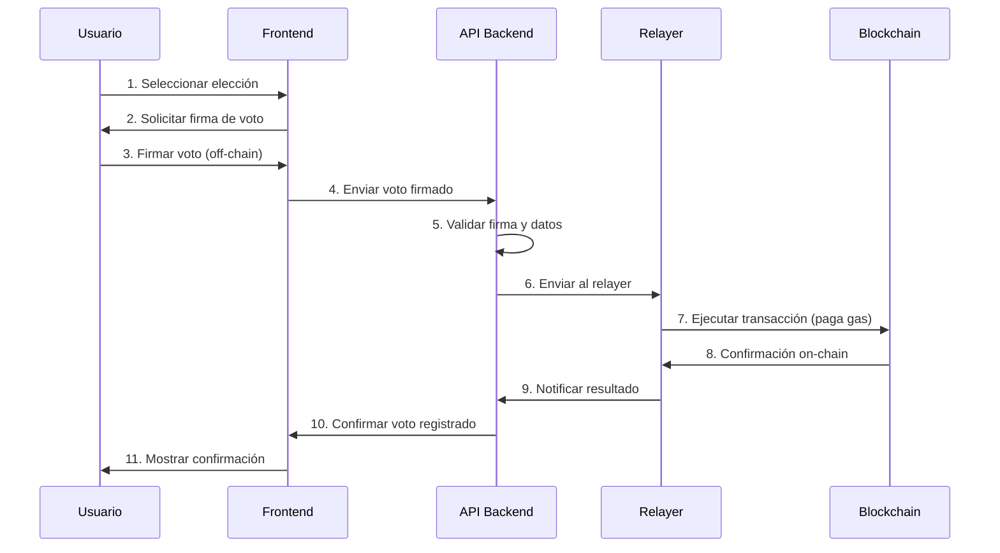

# 🗳️ BLOCKVOTE

**Empowering Fair Elections Through Blockchain Innovation**

[](https://opensource.org/licenses/MIT)
[](https://nodejs.org/)
[](https://megaeth.com/)
[](https://soliditylang.org/)

BlockVote es una plataforma de código abierto que utiliza tecnología blockchain para facilitar elecciones seguras, transparentes y a prueba de manipulaciones. Integra contratos inteligentes, meta-transacciones y interfaces web modernas para ofrecer una solución completa de votación descentralizada.

## 🏗️ Arquitectura

```
Usuario → Firma Off-Chain → API Backend → Relayer → Smart Contract (MegaETH)
```

**Blockchain**: MegaETH Testnet (EVM Compatible)
- **Chain ID**: 6342
- **RPC URL**: https://carrot.megaeth.com/rpc
- **Contrato Desplegado**: `0xC1a9e2cC2C6c83bf486c17AB16127080A442A461`

## 📋 Tabla de Contenidos

- [🚀 Características Principales](#-características-principales)
- [🛠️ Stack Tecnológico](#️-stack-tecnológico)
- [⚡ Inicio Rápido](#-inicio-rápido)
- [🔧 Configuración](#-configuración)
- [🔒 Seguridad](#-seguridad)
- [📊 Funcionalidades](#-funcionalidades)
- [🗳️ Flujo de Votación](#️-flujo-de-votación)
- [🚀 Deployment](#-deployment)
- [🧪 Testing](#-testing)
- [🤝 Contribuir](#-contribuir)

## 🚀 Características Principales

- 🔐 **Meta-Transacciones**: Votación sin gas fees para usuarios finales
- 🗳️ **Smart Contracts Seguros**: Lógica de votación inmutable en blockchain
- 👥 **Gestión de Identidad**: Sistema basado en cédulas dominicanas
- 📊 **Analytics en Tiempo Real**: Dashboard con visualizaciones avanzadas
- 🌐 **API RESTful**: Backend escalable con documentación Swagger
- 🎨 **UI Moderna**: Interface responsive con React y Tailwind CSS
- ⚡ **Alta Performance**: Arquitectura optimizada para manejar múltiples elecciones

## 🛠️ Stack Tecnológico

| Capa | Tecnología | Versión | Propósito |
|------|------------|---------|-----------|
| **Frontend** | React + Vite | ^18.3.1 | Interfaz de usuario |
| **Styling** | Tailwind CSS | ^3.4.14 | Framework CSS utilitario |
| **Animations** | Framer Motion | ^11.11.9 | Animaciones fluidas |
| **Charts** | Apache ECharts | ^5.5.0 | Visualización de datos |
| **Backend** | Node.js + Express | ^4.18.2 | API RESTful |
| **Blockchain** | Ethers.js | ^6.7.0 | Interacción con blockchain |
| **Smart Contracts** | Solidity + Hardhat | ^0.8.20 | Desarrollo de contratos |
| **Documentation** | Swagger UI | ^6.2.8 | Documentación automática |

## ⚡ Inicio Rápido

### Prerequisitos

- **Node.js** v18+ y npm
- **MetaMask** o billetera compatible
- **Fondos de prueba** en MegaETH ([Faucet](https://faucet.trade/megaeth-testnet-eth-faucet))

### Instalación

```bash
# 1. Clonar el repositorio
git clone https://github.com/your-username/blockvote.git
cd blockvote

# 2. Instalar dependencias del backend
cd backend
npm install

# 3. Instalar dependencias del frontend  
cd ../frontend
npm install

# 4. Volver al directorio raíz
cd ..
```

## 🔧 Configuración

### Variables de Entorno

**Backend** (`backend/.env`):
```env
# Blockchain Configuration
BLOCKCHAIN_RPC_URL=https://carrot.megaeth.com/rpc
RELAYER_PRIVATE_KEY=your_64_char_hex_private_key_without_0x

# API Configuration  
PORT=3000
CORS_ORIGIN=http://localhost:5173

# Smart Contract
VOTING_CONTRACT_ADDRESS=0xC1a9e2cC2C6c83bf486c17AB16127080A442A461
```

**Frontend** (`frontend/.env.local`):
```env
VITE_API_BASE_URL=http://localhost:3000
VITE_CONTRACT_ADDRESS=0xC1a9e2cC2C6c83bf486c17AB16127080A442A461
```

### Configuración del Relayer

1. **Generar wallet para el relayer**:
   ```bash
   cd backend
   node -e "console.log(require('crypto').randomBytes(32).toString('hex'))"
   ```

2. **Obtener fondos de prueba** desde el [MegaETH Faucet](https://faucet.trade/megaeth-testnet-eth-faucet)

3. **Configurar la clave privada** en el archivo `.env`

### Ejecutar el Proyecto

```bash
# Terminal 1: Backend (API + Relayer)
cd backend
npm run dev

# Terminal 2: Frontend  
cd frontend
npm run dev
```

Accede a:
- **Frontend**: http://localhost:5173
- **API Docs**: http://localhost:3000/api-docs
- **Health Check**: http://localhost:3000/health

## 🔒 Seguridad

### Medidas Implementadas

- 🛡️ **Firmas Criptográficas**: Cada voto firmado con ECDSA
- 🛡️ **Verificación On-Chain**: Smart contract valida todas las firmas  
- 🛡️ **Prevención de Doble Voto**: Mapping inmutable por usuario
- 🛡️ **Rate Limiting**: Protección contra ataques DDoS
- 🛡️ **Circuit Breaker**: Sistema de protección automática
- 🛡️ **Validación de Identidad**: Verificación de cédulas dominicanas

### Estructura del Smart Contract

```solidity
contract Voting {
    struct Election {
        uint256 id;
        string name;
        uint256 startTime;
        uint256 endTime;
        bool isActive;
        string[] candidates;
    }
    
    mapping(uint256 => mapping(address => bool)) public hasVoted;
    mapping(uint256 => mapping(string => uint256)) public votes;
    
    function voteWithSignature(
        uint256 electionId,
        string memory candidate,
        bytes memory signature
    ) external;
}
```

## 📊 Funcionalidades

### 👥 Roles de Usuario

| Rol | Capacidades | Autenticación |
|-----|-------------|---------------|
| **Votante** | Votar, ver resultados, dashboard personal | Cédula + MetaMask/Generada |
| **Administrador** | Crear elecciones, gestionar candidatos, analytics | Login especial |

### 🗳️ Tipos de Elecciones

- ✅ **Elecciones Simples**: Un candidato por votante
- ✅ **Elecciones Temporales**: Con fecha/hora de inicio y fin  
- ✅ **Análisis Geográfico**: Resultados por provincias de RD
- ✅ **Candidatos Dinámicos**: Gestión flexible de opciones

## 🗳️ Flujo de Votación



### Coverage de Tests

- ✅ Smart Contract: 95%+ coverage
- ✅ API Endpoints: 90%+ coverage  
- ✅ Componentes React: 85%+ coverage

## 📈 Analytics y Métricas

- 📊 **Dashboard en Tiempo Real**: Resultados actualizados automáticamente
- 🗺️ **Análisis Geográfico**: Mapas de calor por provincias  
- 📈 **Tendencias de Participación**: Métricas de engagement
- 🔍 **Auditabilidad Completa**: Historial inmutable de todas las transacciones

## 🔮 Próximas Funcionalidades

### ⚡ Optimizaciones de Rendimiento
- **React Query/SWR**: Cache inteligente para reducir llamadas API
- **Component Splitting**: Modularización de componentes grandes (1300+ líneas)
- **Virtual Scrolling**: Para listas extensas de elecciones y usuarios
- **Lazy Loading**: Carga diferida de gráficos y componentes pesados

### 🎨 Mejoras de UX/UI  
- **Skeleton Loaders**: Loading states más informativos
- **Progressive Loading**: Priorización de datos críticos
- **PWA Support**: Capacidades offline y notificaciones push

## 🤝 Contribuir

¡Las contribuciones son bienvenidas! Por favor:

1. **Fork** el repositorio
2. **Crea** una rama para tu feature (`git checkout -b feature/AmazingFeature`)
3. **Commit** tus cambios (`git commit -m 'Add some AmazingFeature'`)
4. **Push** a la rama (`git push origin feature/AmazingFeature`)
5. **Abre** un Pull Request

### Guías de Contribución

- Seguir los estándares de código con ESLint/Prettier
- Incluir tests para nuevas funcionalidades
- Actualizar documentación cuando sea necesario
- Usar conventional commits para mensajes

## 📄 Licencia

Este proyecto está licenciado bajo la Licencia MIT - ver el archivo [LICENSE](LICENSE) para detalles.

## 🆘 Soporte

- 📧 **Issues**: [GitHub Issues](https://github.com/your-username/blockvote/issues)
- 📖 **Documentación**: [Wiki del Proyecto](https://github.com/your-username/blockvote/wiki)
- 💬 **Discusiones**: [GitHub Discussions](https://github.com/your-username/blockvote/discussions)

## 🙏 Reconocimientos

- **MegaETH Team** - Por la infraestructura blockchain
- **OpenZeppelin** - Por los contratos base de seguridad
- **Hardhat Team** - Por las herramientas de desarrollo

---

<div align="center">

**🗳️ BlockVote - Democratizando la democracia a través de la tecnología blockchain**

[Website](https://blockvote.demo) • [Docs](https://docs.blockvote.demo) • [Twitter](https://twitter.com/blockvote)

</div>
